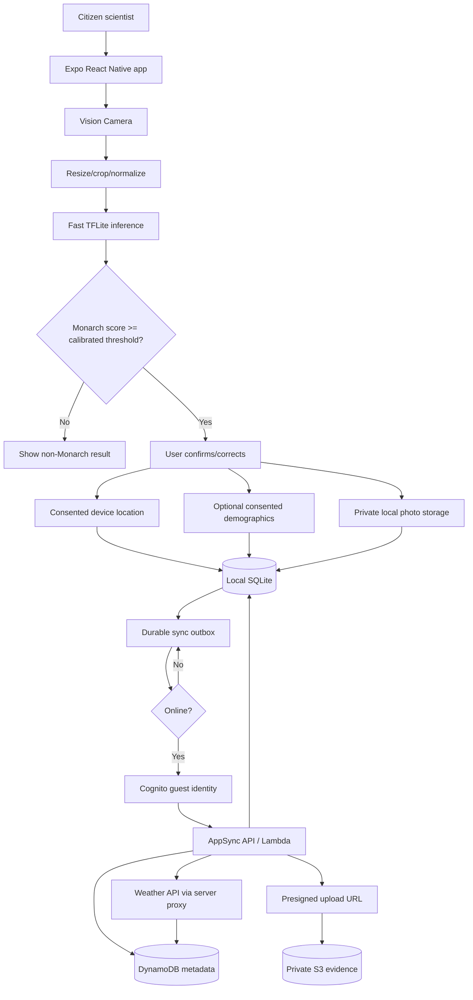

# Monarch Citizen Science Mobile App — Architecture Plan

This is a living architecture document. Update it when the model contract, native dependency versions, data policy, AWS resources, or synchronization protocol changes.

## 1. Project Structure

The repository currently contains the legacy model at `model/monarch_classifier.h5` and its training notebook at `model/CNN_model.ipynb`. The target structure is:

```text
Monarch_mobile_app/
├── app/                         # Expo Router screens and layouts
├── src/
│   ├── camera/                  # Vision Camera permissions/capture
│   ├── ml/                      # TFLite loading, preprocessing, inference
│   ├── observations/            # Observation use cases and validation
│   ├── location/                # Foreground location provider
│   ├── weather/                 # Weather DTOs/cache/API client
│   ├── db/                      # SQLite migrations and repositories
│   ├── sync/                    # Durable outbox and retry worker
│   ├── auth/                    # Cognito guest identity/session
│   ├── api/                     # AppSync and S3 upload clients
│   ├── privacy/                 # Consent, export, deletion, retention
│   └── types/                   # Shared application types
├── assets/models/               # Versioned .tflite and metadata JSON
├── model/                       # Existing H5 model and training notebook
├── scripts/model/               # Conversion and parity validation
├── backend/
│   ├── infrastructure/          # AWS CDK/Amplify infrastructure as code
│   ├── functions/               # Lambda resolvers and enrichment jobs
│   └── tests/                   # Backend integration/security tests
├── tests/                       # Mobile unit and integration tests
├── docs/                        # Privacy, API, model and operational docs
├── .github/workflows/           # CI and EAS build workflows
├── app.config.ts                # Expo plugins, permissions, runtime config
├── eas.json                     # EAS build/submit profiles
├── package.json
├── README.md
└── project-planning.md
```

Architectural rule: camera, ML, database, location, and network code expose interfaces. Screens invoke use cases rather than native SDKs directly, allowing deterministic unit tests.

## 2. High-Level System Diagram



### Capture-to-sync sequence

1. Load the model once when the capture feature opens.
2. Optionally inspect preview frames at 2–5 FPS; drop frames while inference is busy.
3. On capture, store the photo privately and run the canonical still-image preprocessing/inference path.
4. If the calibrated Monarch threshold is met, request user confirmation and foreground location permission.
5. Atomically insert the observation, evidence metadata, and sync jobs before making network calls.
6. When online, authenticate as a Cognito guest, upsert metadata idempotently, upload evidence through a short-lived presigned S3 URL, verify it, and enrich weather for the capture time.

## 3. Core Components

### 3.1 Frontend: Monarch Mobile App

**Purpose:** Capture butterfly evidence, perform private on-device classification, collect consented context, display sync status, and allow corrections/deletion.

**Technologies:** TypeScript, React Native, Expo, Expo Router, `react-native-vision-camera`, `react-native-fast-tflite`, `expo-sqlite`, `expo-location`, `expo-secure-store`, and an AppSync/Amplify client.

**Deployment:** Android and iOS binaries built in EAS. A Windows workstation can develop both platforms; iOS compilation/signing occurs in EAS cloud infrastructure.

**Native constraint:** Vision Camera and Fast TFLite are native modules. Expo Go can exercise JavaScript-only UI, but camera/ML testing requires an EAS custom development build on a physical device.

### 3.2 On-device ML Component

**Purpose:** Classify an image as Monarch/non-Monarch without uploading it.

**Implementation rules:**

- Bundle a versioned `.tflite` asset plus metadata containing SHA-256, input dimensions/dtype, RGB order, normalization, labels, and preprocessing version.
- Verify class order and preprocessing from `model/CNN_model.ipynb`; never guess them from output shape or filenames.
- Apply orientation, crop/letterbox, channel order, dtype conversion, and normalization exactly as training did.
- Reuse one warmed interpreter, serialize inference, and avoid transferring full preview frames over the JavaScript bridge.
- Treat still-image inference as authoritative. Preview inference is only capture guidance unless both paths are proven identical.
- Persist model version/hash, raw score, threshold, and user verdict. A model result is not expert verification.

The initial threshold may be configured to `0.90` for prototyping, but release thresholds must be calibrated on held-out data, including viceroys and other look-alikes.

### 3.3 Backend Service: Observation API

**Purpose:** Authorize users, validate and synchronize metadata, issue constrained upload URLs, reconcile versions, and expose deletion/export workflows.

**Technologies:** AWS AppSync GraphQL, Cognito Identity Pool, Lambda, DynamoDB, S3, TypeScript, and AWS CDK or Amplify infrastructure as code.

**Deployment:** Separate AWS development, staging, and production environments.

### 3.4 Backend Service: Weather Enrichment

**Purpose:** Resolve environmental conditions for observation coordinates and capture time without exposing a provider key in the app.

**Technologies:** Lambda, OpenWeather REST API (or equivalent), Secrets Manager, DynamoDB caching, and CloudWatch.

**Deployment:** Serverless AWS. Enrichment is asynchronous and never blocks the durable local observation save.

### 3.5 Synchronization Worker

**Purpose:** Move local data to AWS safely despite intermittent connectivity, process termination, duplicated calls, and expired credentials.

**Behavior:** Runs on app start/resume, connectivity restoration, and manual retry. Background execution is opportunistic and is not required for correctness. It leases one due job, refreshes identity, sends an idempotency key, retries transient failures with exponential backoff plus jitter, and records actionable terminal errors.

## 4. Data Stores

### 4.1 Local Observation Store

**Name:** Device observation database  
**Type:** SQLite through `expo-sqlite`, with numbered transactional migrations and WAL mode where supported  
**Purpose:** Offline-first source of truth until synchronization succeeds  
**Key tables:** `observations`, `evidence`, `weather_snapshots`, `participant_profile`, `sync_jobs`

Photos remain in private app file storage; SQLite stores their URI, hash, size, and upload state.

```sql
CREATE TABLE observations (
  id TEXT PRIMARY KEY,
  owner_identity_id TEXT,
  captured_at TEXT NOT NULL,
  created_at TEXT NOT NULL,
  updated_at TEXT NOT NULL,
  species_prediction TEXT NOT NULL,
  monarch_probability REAL NOT NULL CHECK(monarch_probability BETWEEN 0 AND 1),
  confidence_threshold REAL NOT NULL,
  user_verdict TEXT CHECK(user_verdict IN ('confirmed','rejected','unsure')),
  model_version TEXT NOT NULL,
  model_sha256 TEXT NOT NULL,
  preprocessing_version TEXT NOT NULL,
  latitude REAL,
  longitude REAL,
  horizontal_accuracy_m REAL,
  altitude_m REAL,
  location_consent INTEGER NOT NULL DEFAULT 0,
  weather_status TEXT NOT NULL DEFAULT 'pending'
    CHECK(weather_status IN ('pending','complete','unavailable','denied')),
  sync_status TEXT NOT NULL DEFAULT 'pending'
    CHECK(sync_status IN ('pending','syncing','synced','failed','tombstoned')),
  remote_version INTEGER,
  last_error_code TEXT,
  deleted_at TEXT
);

CREATE TABLE evidence (
  id TEXT PRIMARY KEY,
  observation_id TEXT NOT NULL REFERENCES observations(id) ON DELETE CASCADE,
  local_uri TEXT NOT NULL,
  sha256 TEXT NOT NULL,
  mime_type TEXT NOT NULL,
  byte_size INTEGER NOT NULL,
  width INTEGER,
  height INTEGER,
  s3_key TEXT,
  upload_status TEXT NOT NULL DEFAULT 'pending'
    CHECK(upload_status IN ('pending','uploading','uploaded','failed')),
  created_at TEXT NOT NULL
);

CREATE TABLE weather_snapshots (
  observation_id TEXT PRIMARY KEY REFERENCES observations(id) ON DELETE CASCADE,
  observed_at TEXT,
  provider TEXT,
  provider_station_or_grid TEXT,
  temperature_c REAL,
  humidity_percent REAL,
  pressure_hpa REAL,
  wind_speed_mps REAL,
  wind_direction_deg REAL,
  precipitation_mm REAL,
  cloud_percent REAL,
  condition_code TEXT,
  raw_payload_json TEXT,
  fetched_at TEXT
);

CREATE TABLE participant_profile (
  local_profile_id TEXT PRIMARY KEY,
  consent_version TEXT NOT NULL,
  consented_at TEXT,
  age_band TEXT,
  experience_level TEXT,
  demographic_region TEXT,
  share_demographics INTEGER NOT NULL DEFAULT 0,
  updated_at TEXT NOT NULL
);

CREATE TABLE sync_jobs (
  id TEXT PRIMARY KEY,
  entity_type TEXT NOT NULL,
  entity_id TEXT NOT NULL,
  operation TEXT NOT NULL,
  state TEXT NOT NULL DEFAULT 'pending',
  attempts INTEGER NOT NULL DEFAULT 0,
  next_attempt_at TEXT NOT NULL,
  lease_expires_at TEXT,
  idempotency_key TEXT NOT NULL UNIQUE,
  last_error TEXT,
  created_at TEXT NOT NULL,
  updated_at TEXT NOT NULL
);

CREATE INDEX idx_observations_sync ON observations(sync_status, updated_at);
CREATE INDEX idx_sync_jobs_due ON sync_jobs(state, next_attempt_at);
CREATE INDEX idx_evidence_observation ON evidence(observation_id);
```

### 4.2 Cloud Metadata Store

**Name:** Observation metadata  
**Type:** DynamoDB  
**Purpose:** Durable, queryable observation, weather, ownership, model provenance, and review status  
**Key design:** Client-generated UUID observation IDs permit offline creation. Use `PK=OBS#<id>`, `SK=META`; add only GSIs required by researcher queries, such as capture date plus a coarse geohash. Precise location must not be exposed through public indexes.

Immutable capture facts and raw model output are first-write-wins. User-editable fields use optimistic concurrency with a server `version`. Conflicts pull the server record, preserve immutable fields, apply a documented field-level merge, and retry.

### 4.3 Evidence Store

**Name:** Observation photographic evidence  
**Type:** Private Amazon S3 bucket  
**Purpose:** Store images independently of DynamoDB metadata  
**Object key:** `private/{identityId}/observations/{observationId}/{evidenceId}.jpg`

Enable S3 Block Public Access, encryption at rest, lifecycle/retention rules, versioning if required, and checksum validation. The backend issues short-lived presigned PUT URLs constrained by owner, key, content type, size, and checksum.

### 4.4 Cloud Sync Strategy

1. A local transaction writes observation, evidence, and outbox rows.
2. The client obtains a Cognito guest identity and calls an AppSync mutation using observation ID plus an idempotency key.
3. A conditional DynamoDB write creates or updates the logical record and returns its authoritative version.
4. The client requests a presigned URL and uploads directly to S3, not through AppSync.
5. A completion mutation sends the object key and SHA-256. Lambda verifies ownership, size, and checksum before marking evidence complete.
6. Weather enrichment runs for the original capture timestamp.
7. Local rows become `synced` only after both metadata and evidence are acknowledged.
8. Timeouts, throttling, 5xx responses, and connectivity failures retry with capped exponential backoff and jitter. Validation/authorization errors remain visible until corrective action.
9. Deletion uses a local tombstone until the server and S3 deletion workflow acknowledge it.

This produces exactly-once logical state from at-least-once network delivery.

## 5. External Integrations / APIs

### Device Camera

**Service:** iOS/Android camera hardware  
**Purpose:** Preview and high-quality still capture  
**Method:** `react-native-vision-camera`; foreground permission requested in context

### Device Location

**Service:** Platform location provider  
**Purpose:** Obtain a one-shot location near capture time  
**Method:** `expo-location`; foreground permission only for the first release

Persist accuracy and timestamp. Allow observation without location. Reject or flag stale/inaccurate fixes according to an agreed research rule.

### Weather Provider

**Service:** OpenWeather or equivalent  
**Purpose:** Temperature, humidity, pressure, wind, precipitation, cloud, and condition context  
**Method:** Server-side REST call through Lambda

The provider key lives in Secrets Manager, never in `EXPO_PUBLIC_*` configuration. Use historical/time-machine data for delayed uploads. If the provider cannot return capture-time weather, store `unavailable`; do not mislabel sync-time weather. Cache by coarse spatial cell and time bucket.

### AWS APIs

**Services:** Cognito, AppSync, S3  
**Purpose:** Guest credentials, authorized metadata synchronization, evidence upload  
**Method:** AWS SDK/Amplify client with short-lived credentials and TLS

## 6. Deployment & Infrastructure

**Cloud provider:** AWS  
**Key services:** Cognito Identity Pool, AppSync, Lambda, DynamoDB, S3, Secrets Manager, CloudWatch, X-Ray, IAM, and optionally WAF  
**Infrastructure as code:** AWS CDK or Amplify, reviewed and deployed per environment  
**Mobile CI/CD:** GitHub Actions plus Expo Application Services  
**Monitoring:** CloudWatch structured logs/metrics/alarms and X-Ray traces, with coordinates, demographics, images, and tokens redacted

Example `eas.json`:

```json
{
  "cli": { "version": ">= 12.0.0", "appVersionSource": "remote" },
  "build": {
    "development": {
      "developmentClient": true,
      "distribution": "internal",
      "channel": "development"
    },
    "preview": {
      "distribution": "internal",
      "channel": "preview",
      "android": { "buildType": "apk" }
    },
    "production": {
      "autoIncrement": true,
      "channel": "production"
    }
  },
  "submit": { "production": {} }
}
```

Typical Windows commands:

```powershell
npm ci
npx expo-doctor
npx eas-cli build --profile development --platform android
npx eas-cli build --profile development --platform ios
npx eas-cli build --profile production --platform all
```

EAS supplies macOS build infrastructure, but Apple Developer credentials and device provisioning are still required. Use EAS Update only for JavaScript/assets compatible with the installed native runtime; native dependency changes require a new binary and matching `runtimeVersion` policy.

### CI/CD gates

1. **Pull request:** lockfile install, formatting, ESLint, TypeScript, Jest, DB migration tests, secret scan, and model metadata/hash verification.
2. **Main:** deploy an isolated development backend and create internal EAS preview builds.
3. **Release candidate:** model parity/accuracy gate, physical-device performance, offline/process-death, migration, accessibility, and privacy/security review.
4. **Production:** staged backend deployment, signed EAS builds, store submission, staged rollout, and rollback monitoring.

## 7. Security Considerations

### Authentication

Use a Cognito Identity Pool with unauthenticated/guest identities for low-friction onboarding. Offer an optional account upgrade/linking path so a guest can preserve observations across devices. Store tokens/credentials using `expo-secure-store`, not AsyncStorage.

### Authorization

- AppSync resolvers enforce ownership using the Cognito identity, not a client-supplied owner ID.
- IAM grants only required AppSync operations; clients do not receive general DynamoDB or S3 access.
- Presigned URLs cover one expected object and expire quickly.
- Research/admin access is a separate audited role; public map data is a redacted projection.

### Data protection and privacy

- TLS in transit and AWS-managed/KMS encryption at rest.
- Private app files and SQLite storage on-device; use OS-backed secure storage for secrets.
- Strip unnecessary EXIF before upload. Keep location in protected metadata.
- Ask separately for camera, location, photo sharing, and demographics; the app remains useful when optional permissions are denied.
- Demographics are optional, minimized, and never inferred. Precise location is not part of the demographic profile.
- Round/obscure coordinates and delay publication when participant or wildlife safety requires it.
- Define retention, consent versioning, export, deletion, minors/children policy, and appropriate ethics/IRB review.

### Backend validation and abuse protection

Validate image magic bytes, MIME type, size, dimensions, checksum, numeric ranges, timestamps, and ownership. Use throttling/quotas, WAF where appropriate, short URL lifetimes, anomaly alarms, and a review/report path. Never log tokens, photos, demographics, or precise coordinates.

## 8. Development & Testing Environment

### 8.1 Legacy H5 to TFLite workflow

Create a reproducible environment:

```powershell
py -3.11 -m venv .venv-model
.venv-model\Scripts\Activate.ps1
python -m pip install --upgrade pip
python -m pip install "tensorflow==2.16.1" "numpy>=1.26,<2.0"
```

If legacy deserialization fails, reproduce the original TensorFlow/Keras version. For custom layers, import them and pass `custom_objects`. Do not replace unsupported layers silently.

Save the following exact implementation as `scripts/model/convert_h5_to_tflite.py`:

```python
from __future__ import annotations

import argparse
import hashlib
import json
from pathlib import Path

import tensorflow as tf


def representative_dataset(directory: Path, height: int, width: int):
    paths = [
        p for p in directory.rglob("*")
        if p.suffix.lower() in {".jpg", ".jpeg", ".png"}
    ][:500]
    if not paths:
        raise ValueError(f"No calibration images found in {directory}")

    for path in paths:
        raw = tf.io.read_file(str(path))
        image = tf.io.decode_image(raw, channels=3, expand_animations=False)
        image = tf.image.resize(image, [height, width], antialias=True)
        image = tf.cast(image, tf.float32) / 255.0
        # Replace this preprocessing if the training notebook used a model-
        # specific preprocess_input, mean/std, letterbox, or other operation.
        yield [tf.expand_dims(image, 0).numpy()]


def tensor_metadata(tensor):
    return {
        "name": tensor["name"],
        "shape": tensor["shape"].tolist(),
        "dtype": str(tensor["dtype"]),
        "quantization": list(tensor["quantization"]),
    }


def main() -> None:
    parser = argparse.ArgumentParser()
    parser.add_argument("--input", type=Path, required=True)
    parser.add_argument("--output", type=Path, required=True)
    parser.add_argument(
        "--quantization",
        choices=("float32", "dynamic", "float16", "int8"),
        default="float16",
    )
    parser.add_argument("--representative-data", type=Path)
    parser.add_argument("--metadata-output", type=Path)
    args = parser.parse_args()

    # compile=False avoids requiring training-only optimizer/loss objects.
    # Add custom_objects={"CustomLayer": CustomLayer} when required.
    model = tf.keras.models.load_model(args.input, compile=False)
    model.summary()

    input_shape = model.inputs[0].shape
    if len(input_shape) != 4 or input_shape[1] is None or input_shape[2] is None:
        raise ValueError(f"Expected a fixed NHWC image input, got {input_shape}")
    height, width = int(input_shape[1]), int(input_shape[2])

    converter = tf.lite.TFLiteConverter.from_keras_model(model)

    if args.quantization == "dynamic":
        converter.optimizations = [tf.lite.Optimize.DEFAULT]
    elif args.quantization == "float16":
        converter.optimizations = [tf.lite.Optimize.DEFAULT]
        converter.target_spec.supported_types = [tf.float16]
    elif args.quantization == "int8":
        if args.representative_data is None:
            raise ValueError("--representative-data is required for int8")
        converter.optimizations = [tf.lite.Optimize.DEFAULT]
        converter.representative_dataset = lambda: representative_dataset(
            args.representative_data, height, width
        )
        converter.target_spec.supported_ops = [
            tf.lite.OpsSet.TFLITE_BUILTINS_INT8
        ]
        converter.inference_input_type = tf.int8
        converter.inference_output_type = tf.int8

    tflite_bytes = converter.convert()
    args.output.parent.mkdir(parents=True, exist_ok=True)
    args.output.write_bytes(tflite_bytes)

    interpreter = tf.lite.Interpreter(model_content=tflite_bytes)
    interpreter.allocate_tensors()
    metadata = {
        "source": str(args.input),
        "quantization": args.quantization,
        "sha256": hashlib.sha256(tflite_bytes).hexdigest(),
        "inputs": [tensor_metadata(x) for x in interpreter.get_input_details()],
        "outputs": [tensor_metadata(x) for x in interpreter.get_output_details()],
        # Replace these only after verifying the notebook/training class_indices.
        "labels": ["non_monarch", "monarch"],
        "preprocessing": "RGB resize; float32 / 255.0 — VERIFY WITH NOTEBOOK",
    }
    metadata_path = args.metadata_output or args.output.with_suffix(".json")
    metadata_path.write_text(json.dumps(metadata, indent=2), encoding="utf-8")
    print(json.dumps(metadata, indent=2))


if __name__ == "__main__":
    main()
```

The label order and `/255.0` normalization above are deliberately marked for verification against `model/CNN_model.ipynb`. They must match training exactly.

Generate candidates:

```powershell
# Accuracy baseline
python scripts/model/convert_h5_to_tflite.py `
  --input model/monarch_classifier.h5 `
  --output assets/models/monarch_classifier_float32.tflite `
  --quantization float32

# Recommended first mobile candidate: float16 weights, float I/O
python scripts/model/convert_h5_to_tflite.py `
  --input model/monarch_classifier.h5 `
  --output assets/models/monarch_classifier_float16.tflite `
  --quantization float16

# Optional full integer candidate
python scripts/model/convert_h5_to_tflite.py `
  --input model/monarch_classifier.h5 `
  --output assets/models/monarch_classifier_int8.tflite `
  --quantization int8 `
  --representative-data data/calibration
```

Keep INT8 calibration images separate from the held-out evaluation set. For quantized runtime I/O use the tensor scale and zero point: `q = round(real / scale + zero_point)` with dtype clipping, and `real = scale * (q - zero_point)` for dequantization.

Before bundling a model:

1. Compare Keras and each TFLite candidate on identical preprocessed images.
2. Measure classification agreement, probability drift, accuracy, per-class precision/recall, F1, PR-AUC, confusion matrix, and calibration.
3. Benchmark size, cold/warm p50/p95 latency, memory, sustained heat, and battery on low/mid-range Android and the oldest supported iPhone.
4. Prefer float16 unless INT8 provides a material device benefit without unacceptable recall or calibration loss.
5. Commit the chosen model, metadata, threshold, SHA-256, conversion command, and validation report as one release unit.

### 8.2 Test strategy

**Unit tests — Jest and React Native Testing Library**

- Preprocessing fixtures for orientation, crop/letterbox, RGB order, dtype, normalization, and shape.
- Sigmoid/softmax and float/quantized output decoding.
- Threshold boundaries, label mapping, and user correction.
- Atomic observation/outbox writes and SQLite migrations.
- Queue leases, ordering, idempotency, retry/backoff, conflict merging, and tombstones.
- Location denied/stale/inaccurate states and weather caching/error normalization.
- Guest credential expiry/refresh and guest-to-account migration.

**Model tests**

- A versioned golden set of Monarchs, viceroys/look-alikes, partial subjects, empty frames, varied lighting, angles, and backgrounds.
- Automated Keras/TFLite parity with an approved metric-regression tolerance.
- Physical-device latency, memory, heat, battery, and app-size gates.

**Integration and end-to-end tests**

- AppSync owner isolation, conditional writes, presigned URL scope/expiry/checksum, S3 verification, and weather failures in an isolated AWS environment.
- Airplane-mode capture, process kill after each sync step, connectivity flapping, duplicate requests, expired upload URL, auth expiry, low disk, partial upload, reboot, and database upgrade.
- Maestro or Detox for stable UI flows; real devices for camera and ML assertions.
- Accessibility checks for screen readers, focus order, dynamic type, contrast, large targets, and permission recovery.

| Target | Use |
|---|---|
| Jest/Node | Pure logic, mocked adapters, state machine, preprocessing math |
| Expo Go | JavaScript UI/navigation and Expo-supported APIs only |
| EAS development build | Vision Camera, Fast TFLite, native permissions, SecureStore, profiling |
| EAS preview build | Complete staging beta and offline/upgrade tests |
| Store-signed build | Signing, privacy declarations, release behavior |

Release acceptance requires: offline capture and durable save; survival across force-close/restart; eventual one logical cloud record despite retries; private verified evidence upload; capture-time weather or an explicit unavailable state; and no production secrets in the binary.

### 8.3 Code quality

Use strict TypeScript, ESLint, Prettier, Jest, dependency auditing, secret scanning, infrastructure policy checks, and pinned compatible versions of Expo/React Native/Vision Camera/Worklets/Fast TFLite. Run `npx expo-doctor` after every native dependency change.

## 9. Future Considerations / Roadmap

### Phase 0 — Research and model contract

- Recover preprocessing and class order from the notebook.
- Convert and evaluate float32, float16, and optional INT8 artifacts.
- Agree on confidence threshold, consent, coordinate precision, retention, and expert-review states.

### Phase 1 — Native vertical slice

- Bootstrap Expo TypeScript and custom EAS development builds.
- Demonstrate capture → preprocessing → inference → confirmation on physical Android and iOS devices.

### Phase 2 — Offline-first collection

- Implement SQLite migrations, private evidence storage, consented location/profile, and durable outbox.
- Pass airplane-mode and process-death recovery tests.

### Phase 3 — AWS synchronization

- Provision Cognito, AppSync, Lambda, DynamoDB, S3, Secrets Manager, and monitoring.
- Implement idempotent metadata sync, evidence verification, conflicts, tombstones, and historical weather enrichment.

### Phase 4 — Beta and production hardening

- Complete field/device testing, accessibility, security/privacy review, coordinate protection, operational dashboards, and researcher export controls.
- Establish model update governance, signed artifact manifests, compatibility rules, staged rollout, and rollback.

Future candidates include expert verification workflows, maps using obscured coordinates, multi-species models, multilingual/offline field guides, optional account linking, and WatermelonDB only if observation scale/profile measurements show SQLite repository performance is insufficient.

## 10. Project Identification

**Project name:** Monarch Citizen Science Mobile App  
**Repository:** Local repository `Monarch_mobile_app` (remote URL not yet documented)  
**Primary team:** Inspirit AI Mentorship Program — project team  
**Last updated:** 2026-08-30  
**Supported platforms:** iOS and Android through Expo/EAS  
**Primary domain:** Citizen science / wildlife tracking

## 11. Glossary / Acronyms

| Term | Definition |
|---|---|
| EAS | Expo Application Services; cloud build, submit, and update services |
| TFLite | TensorFlow Lite; mobile/edge model format and runtime |
| H5 | Legacy HDF5-based Keras model format |
| PTQ | Post-training quantization |
| AppSync | AWS managed GraphQL service |
| Cognito | AWS identity/authentication service |
| DynamoDB | AWS managed NoSQL database |
| S3 | Amazon Simple Storage Service |
| Outbox | Durable local queue written transactionally with domain data |
| Idempotency | Repeating an operation produces one logical result |
| Presigned URL | Time-limited, narrowly scoped authorization for an S3 operation |
| WAL | SQLite write-ahead logging mode |
| Model contract | Versioned input/output, preprocessing, labels, threshold, and artifact metadata |

## Principal Risks and Controls

| Risk | Control |
|---|---|
| Unknown training preprocessing/class order | Notebook inspection and Keras/TFLite parity are release blockers. |
| Expo/native package incompatibility | Pin a tested version matrix and create custom development builds early. |
| Battery/thermal load | Throttle preview inference, serialize work, pause when inactive, and use authoritative still inference. |
| Quantization accuracy loss | Evaluate float32/float16/INT8 on held-out data and real devices. |
| Offline duplication or loss | UUIDs, transactional outbox, idempotency keys, conditional writes, and checksums. |
| Incorrect weather time | Query capture time; explicitly mark unavailable rather than substitute current weather. |
| Guest identity loss after reinstall | Explain limitations and offer optional account linking/upgrade. |
| Location/privacy exposure | Minimize data, separate consent, restrict raw access, obscure public coordinates, and audit access. |
| Provider cost/abuse | Server-held keys, cache, quotas, throttling, validation, lifecycle rules, and alarms. |

## Definition of Done

- Model preprocessing, labels, threshold, metrics, artifact hash, and conversion are reproducible.
- Physical iOS and Android devices run the versioned model in EAS-built binaries.
- A positive observation is atomically stored with evidence and sync intent before networking.
- Location and demographics remain optional, consented, and represent missing states honestly.
- Metadata and evidence synchronize securely and idempotently after offline use.
- Weather represents capture time or is explicitly unavailable.
- AWS resources are infrastructure-as-code, least privilege, monitored, and environment-separated.
- Unit, model parity, integration, offline recovery, security, accessibility, and performance gates pass.
- Users can see sync status and exercise documented consent, export, and deletion controls.
